**Segmentacion, rastreo y analisis post-partido de robots participantes de la Copa FutBot MX utilizando Segment Anything Model 3**

*Angel Gabriel Jimenez Isidro*

**Resumen:** Se expone el proceso de desarrollo de un flujo de procesamiento para rastrear, segmentar y analizar robots competidores de la Copa FutBot Mx (Federación Mexicana de Robótica) mediante técnicas de visión computacional, transformación de perspectivas y análisis de datos. Se usó el modelo Segment Anything Model 3 como herramienta central en su configuración base (sin ajuste fino ni entrenamiento) a través de la librería de Ultralytics. Los resultados incluyen: video con anotaciones y segmentaciones de los robots combinado con el mapa táctico, con las coordenadas estimadas mediante homografía. Archivos CSV con datos de posición y velocidad, los cuales fueron sometidos a un breve análisis con estadísticas generales de cada robot. El análisis aplica solamente para videos con cámara fija, en una vista cenital ligeramente desviada pero que se puedan apreciar al menos 4 puntos distintivos del campo de juego. No es aplicable aun para videos con diferentes tomas, acercamientos o cambios de ángulos.

1.  ***Introducción y objetivos***

Este documento pretende ser un registro y explicación de cómo fue el proceso de desarrollo, aprendizaje, resolución de obstáculos. Si bien tiene una estructura similar a la de un paper, no cuenta con todos los requisitos de estilo ni rigurosos. La participación es en la categoría amateur, pero se usó este formato ya que permite explicar de forma detallada todo el proceso de aprendizaje, obstáculos encontrados así como algunas observaciones y comentarios sobre cada etapa.

En un inicio quería crear un prototipo de aplicación con interfaz amigable que pudiera servir para casi cualquier video. Esta aplicación tendrá las siguientes características:

-   Mostrar el campo canónico al lado del video

-   Rastrear a los robots a lo largo del partido y detectar pases y goles en tiempo real.

-   Mostrar un registro de eventos al costado en el que fueran apareciendo en texto los eventos a medida que ocurrían.

-   Poder descargar los datos de posición, velocidad y tiempo al finalizar el video.

Sin embargo en aquel momento desconocía de la capacidad de procesamiento requerida para poder utilizar SAM 3, desconocía cómo usar las librerías de ultralytics y supervision. No estaba enterado de todos los errores en Python que podían surgir al procesar las detecciones o generar las visualizaciones en los videos. Tenía planeado apoyarme con Claude y la interfaz amigable de Roboflow para gran parte del proceso, pero decidí reescribir cada uno de los notebooks línea por línea y entender cómo funcionan los ecosistemas de ultralytics y supervisión.

Desde mi experiencia y perspectiva, la parte más trabajosa fue entender cómo aplicar y desplegar un modelo de visión computacional, entender todo el ecosistema que lo maneja y contiene, como conectarlo con otras aplicaciones o dependencias. Tengo la impresión de que es mucho más fácil entrenar un modelo y evaluar sus métricas. Estas opiniones pueden estar muy sesgadas debido a que este fue mi primer contacto con el entorno de librerías como supervision y ultralytics, posiblemente mi visión cambie una vez tenga mas experiencia.

# 2.  ***Entorno de desarrollo y herramientas***

Todos los cuadernos fueron elaborados en un entorno en la nube de Google Colab. A excepción del notebook 0 de exploración, el cual fue desarrollado en un entorno de Kaggle debido a que los límites de uso de GPU y RAM son más amplios, pues se requería mucho tiempo de depuración y varias pruebas de prompts en un solo video.

## a.  **Uso de modelos de lenguaje en el proyecto**

Los modelos de lenguaje se usaron para poder entender mejor algunos conceptos, pedir recomendaciones de modelos específicos, por ejemplo "un modelo no supervisado similar a DINO v3 que sea sensible al color". Se usaron tanto Claude como Gemini. Fueron cruciales en los últimos 7 días previos a la fecha de entrega.

No se realizaron consultas pidiendo que realizaran todo el código del proyecto. Más bien funciones y bloques específicos. Claude proporcionó las funciones para poder guardar las segmentaciones en formato JSON, así como para importarlas de nuevo en formato sv.Detections. Gemini fue crucial en la limpieza y reestructuración de los datasets de posición y velocidad de cada robot mediante la librería de Pandas, así como para crear

Para la documentación, se hicieron consultas sobre como estructurar mejor las secciones del archivo [[README.md]{.underline}](http://readme.md), las consultas se hicieron a Gemini.

Se uso Claude para generar el archivo de licencia para el repositorio de GitHub, asi como la presentacion de PowerPoint.

# 3.  ***Fase exploración y problemas encontrados (Notebook 0)***

Esta fase fue crucial pues definió cuál sería la aproximación para este proyecto. Aquí se integraron todos los conocimientos desde el Notebook 1 hasta el 12, para poder crear una visualización experimental en un video de 1 minuto. Cabe mencionar que SAM 3 tardó alrededor de 12 minutos en procesar los 1800 frames (aproximadamente) de todo el minuto.

## a.  **Cálculo de homografía y campo canónico**

Esta parte es vital pues sin esta no seria posible recrear el mapa táctico, las posiciones reales ni la velocidad de cada objeto dentro de la cancha. Para esto se asume que hay una vista "distorsionada" y una "vista real". Estas dos vistas corresponden a diferentes perspectivas de un mismo plano. Para poder hacer la transformación de una vista oblicua a una vista cenital se requiere de una matriz de transformación H, y se requieren 4 puntos muestras de la vista oblicua y sus correspondientes en la vista cenital canónica.

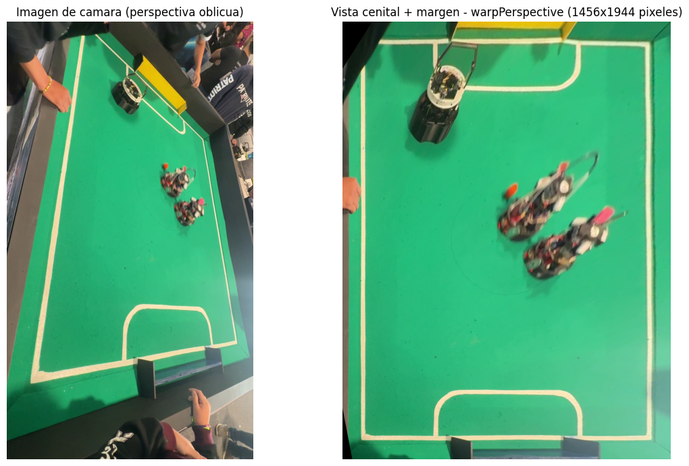{width="4.147391732283465in" height="2.802292213473316in"}

Esta transformación asume que todos los objetos dentro de la imagen se encuentran en el mismo plano, por lo que al transformar toda la imagen completa se generan distorsiones en objetos que no se encuentran en ese plano, tales como los robots o las porterías. En el notebook estos se introdujeron de forma *hardcodeada*, y para facilitar la identificacion de cada punto se consultó el reglamento y las medidas oficiales, para recrear en GeoGebra cada punto característico de la cancha. La siguiente imagen, proveniente del reglamento oficial de la Copa FutBot MX 2026.

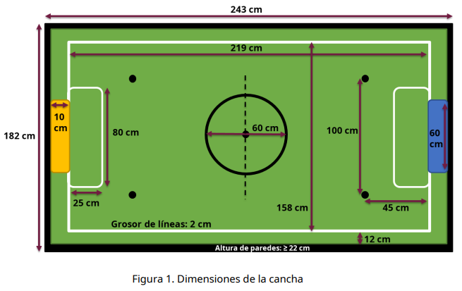{width="4.952772309711286in" height="3.126010498687664in"}

Esa imagen fue recreada en GeoGebra para verificar de forma precisa cada punto correspondiente. Este diagrama sirve para cualquier proyección que quiera hacerse en formato vertical. Es importante recalcar que para las coordenadas en visión computacional, el punto de origen es la esquina superior izquierda, y no la esquina inferior izquierda (a como la mayoría de gente esta acostumbrada). Si se quisiera crear un mapa táctico a una escala mayor, bastaría con multiplicar las coordenadas de los puntos de la imagen por dicha escala.

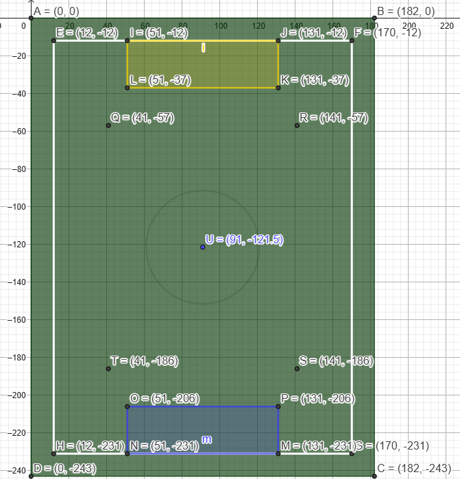{width="4.3746708223972in" height="4.555364173228346in"}

Para seleccionar de forma precisa y correcta los puntos muestra del video original se uso la herramienta interactiva en línea de Roboflow [[https://polygonzone.roboflow.com/]{.underline}](https://polygonzone.roboflow.com/) que permite subir cualquier imagen y genera un arreglo de numpy con las coordenadas en pixeles de cada uno de los puntos seleccionados.

## b.  **Calculo de velocidad**

Se tuvo la intención de calcular la velocidad pero los resultados no fueron precisos. La intención era usar la posición de hace 15 o 10 frames, pero se necesitaba una lista que guardara las 15 posiciones previas de cada una de las detecciones, un buffer. Por lo que la velocidad que se muestra en las etiquetas no representa la velocidad real, sino una estimación. La velocidad se anota en decímetros por segundo.

## c.  **Generación de mapa táctico con OpenCV**

Para generar una vista del campo canónico justo a un lado del video exportado se recurrió a OpenCV dado que genera las anotaciones e imágenes de forma más rápida que librerías como matplotlib. El código base se encontraba en los notebooks 10 y 11 de Thinkific. Ese codigo generaba en una misma funcion la imagen de la cancha y generaba los dibujos de los robots. Se cambio un poco el funcionamiento de tal forma que la generacion del mapa tuviera su propia funcion, mientras que los dibujos de los robots tenian una funcion para cada uno. Asimismo, el mapa original del notebook era una aproximación del mapa real. Durante el desarrollo se investigaron las medidas exactas de la cancha y se generó un nuevo mapa táctico adaptado a esas medidas. Se muestra la comparación entre el mapa original del notebook (izquierda) y el mapa generado en el proyecto (derecha), se dibujaron también los "puntos neutrales" en los que la pelota es reposicionada por el referee en ciertos momentos del partido. Esto requirió del entendimiento de las funciones de dibujo de OpenCV así como de consultar la documentación y los argumentos requeridos.

  -----------------------------------------------------------------------------------------------------------------------------------------------------------------------------
  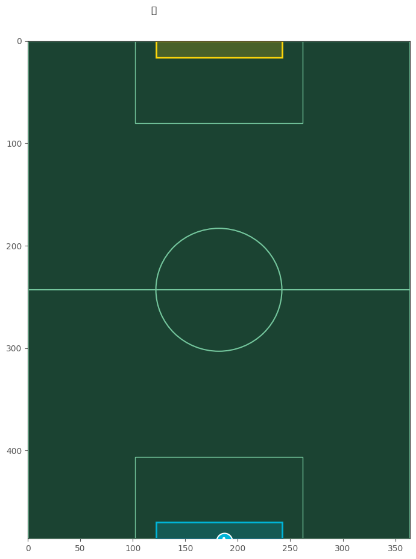{width="2.9791666666666665in" height="4.0in"}   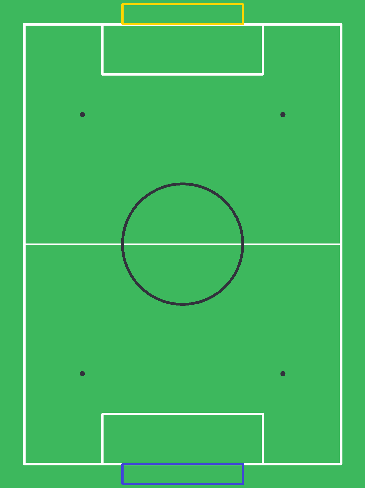{width="2.9791666666666665in" height="3.9722222222222223in"}
  ------------------------------------------------------------------------------ ----------------------------------------------------------------------------------------------

  -----------------------------------------------------------------------------------------------------------------------------------------------------------------------------

## d.  **Exportación de video lado a lado**

Aquí se puede dividir en dos partes: el uso de vstack y hstack y la generacion de las anotaciones en el mapa táctico. Se usaron las herramientas de lectura de video y escritura que OpenCV ya tiene por defecto, en lugar de supervision.ProcessVideo, ya que se cuenta con más opciones de personalización.

Primero, respecto al tamaño y resolución del video, pueden ser las medidas que se deseen, pero se requiere de un conocimiento preciso y exacto de las medidas de los pixeles de cuadros de entrada y de salida,de otra forma se va a generar un archivo .mp4 vacío. Se usan las funciones de numpy vstack o hstack dependiendo de si se desea colocar arriba o al lado. La siguiente imagen fue sacada de StackOverflow del post: [[https://stackoverflow.com/questions/33356442/when-should-i-use-hstack-vstack-vs-append-vs-concatenate-vs-column-stack]{.underline}](https://stackoverflow.com/questions/33356442/when-should-i-use-hstack-vstack-vs-append-vs-concatenate-vs-column-stack)

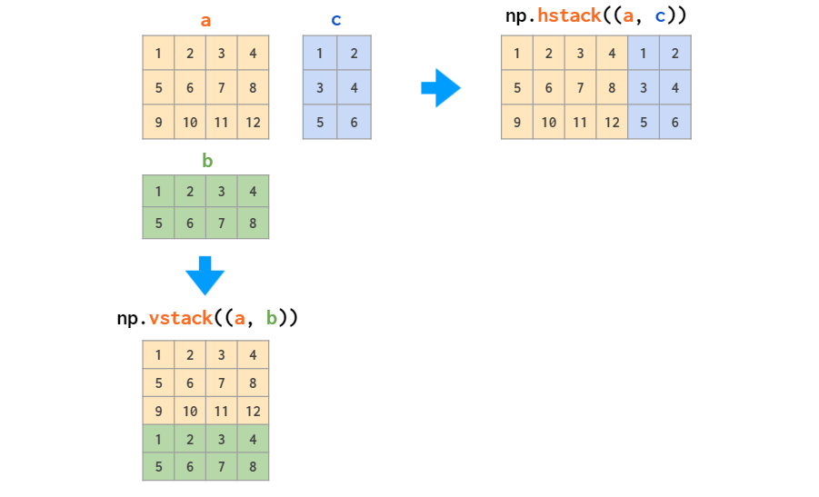{width="3.463542213473316in" height="2.8797101924759403in"}

De igual forma, se tomaron como base los códigos y funciones de ejemplo que estaban en el notebook 11 del curso para poder generar el video segmentado junto con el mapa canónico. Los códigos y funciones fueron reescritos y readaptados. Se muestra la comparación entre el video generado por el notebook del curso (arriba) y el video generado para este proyecto (abajo).

  --------------------------------------------------------------------------------------------
  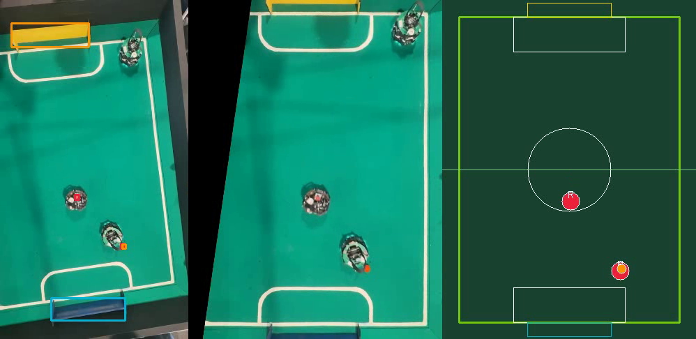{width="6.114583333333333in" height="2.9722222222222223in"}
  --------------------------------------------------------------------------------------------
  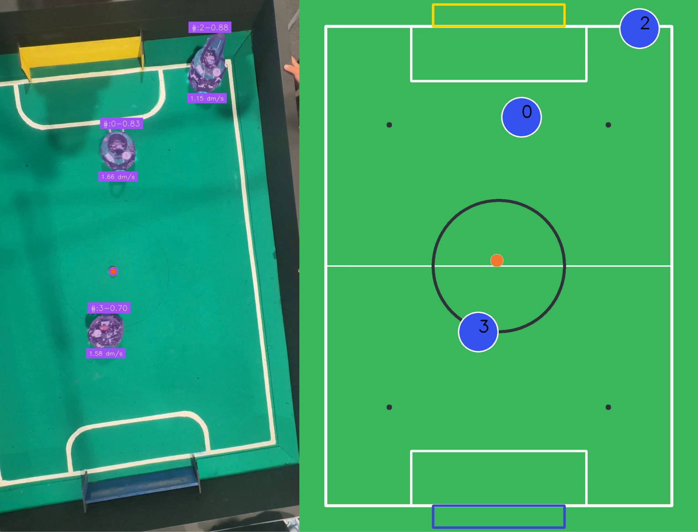{width="6.114583333333333in" height="4.666666666666667in"}

  --------------------------------------------------------------------------------------------

# 4.  ***Problemas encontrados en la fase de exploración***

```{=html}
<!-- -->
```
### a.  **Capacidad de procesamiento requerida para SAM 3**

Para darse una idea de la capacidad de procesamiento requerida. Para poder rastrear 4 o 5 objetos en un video a 30 FPS, en tiempo real, se requiere de una tarjeta H200. Para rastrear hasta 10 objetos se requirió de dos H200 (también en 30 FPS), para rastrear hasta 28 objetos se utilizaron cuatro H200. Esta información se encuentra en el paper original. El precio de uno solo de estos equipos ronda entre los 35,000.00 y 45,000.00 dolares.

Es un modelo bastante poderoso y capaz, y es prácticamente imposible para la mayoría de las personas ejecutarlo en tiempo real en videos a 30F FPS o más. Aun así, su capacidad es impresionante pues llega a suceder que segmenta cosas que un humano no ve a simple vista, como robots que estaban detrás de una persona o escondidos en el fondo al lado de una laptop.

### b.  **Poca presencia de videos adecuados**

Logre identificar dos videos con cámara fija y de duración adecuada. Les faltaba una sección de la cancha y se logró hacer el análisis a pesar de esto. No se está afirmando que son videos obtenidos de una forma inadecuada, sino que para el nivel del equipo (y el objetivo del análisis) las técnicas necesarias para procesarlos requieren de más tiempo y preparación, específicamente entrenar un modelo que detecte los puntos clave de la cancha y realizar una transformación mediante homografía y aproximar las posiciones reales de los jugadores en la cancha. Claro que se pueden rastrear y segmentar pero los resultados podrían ser más inconsistentes si no son tomas fijas.

### c.  **Problemas de segmentación de robots y pelota en un mismo video**

Al definir entradas de texto como \["small robot","orange ball"\] el modelo identificaba uno que otro robot como una pelota naranja en lugar de robot, muy posiblemente porque había momentos en los que las luces rojas se tornaban naranjas o había partes del robot que eran rojizas. También pasaba que partes del cuerpo como una mano, un dedo o una pulsera eran detectadas como "small orange ball". Debido a esto se decidió crear un detector aparte para la pelota, basado en filtros HSV. El texto que presentaba menos anomalías para la pelota era "tennis ball" o "orange tennis ball", si ocurren las anomalías mencionadas pero con menos frecuencia.

Lo anterior se pudo haber resuelto mediante ejemplos negativos o indicarle al modelo que cosas no debía segmentar. Sin embargo, el notebook en el cual se hablaba de esto no fue revisado a profundidad por el equipo así que este tipo de prompts no fueron aplicados aquí.

### d.  **Problemas de segmentación de robots por color o por equipo.**

Otro de los problemas que se presentaban al usar Promptable Concept Segmentation es que tampoco se podían segmentar por equipos. Se intentaron prompts como "green robot", "black robot", "green team robot", "black team robot", "robot with a green circle", "robot with black case". Ocurría que no detectaba a todos los robots de la forma esperada.

Los prompts con mejor resultado fueron "robot" y "small robot", también se intentó con "small vehicle" pero no segmentó todos los robots. Esto fue ya después de haber decidido no segmentar la pelota en el mismo prompt.

### e.  **Inconsistencia de los IDs de rastreo a lo largo de todo el video.**

No es un inconveniente solamente de SAM 3, sino que puede ocurrir en otros modelos. Hubo muchas ocasiones en que los robots salen de la vista de la cámara y reingresaban. A pesar de que un humano podía identificar que eran los mismos robots por las etiquetas que tenían adheridas a la parte superior (10A, 10B y 17B), el rastreador nativo de SAM no logró eso al menos de una forma estable, pues asignaba nuevas IDs a los robots. Considerando que se usó a través de la librería de Ultralytics y no mediante los códigos e instrucciones específicas de SAM en Hugging Face. Posiblemente una modificacion en los parametros habria podido reducir esto.

Se identificaron en total 328 numeros de rastreo, de los cuales una buena parte correspondian a objetos que eran falsos positivos, como un baston, una porteria, una mano o incluso la cancha completa (este ultimo ocurria al final cuando ya no habian robots en la cancha).

### f.  **Resultados de agrupación con K Means y SigLIP (en lugar de DINOv3)**

Para tratar de resolver el punto anterior se decidió explorar el notebook 14 donde utilizaba DINO v3, en los ejemplos se mostraba que la similitud coseno entre la imagen de un robot en escala de grises y su original era muy cercana a 1. Lo cual indica que no es sensible al cambio de color, al menos en estos robots. Se decidió usar SIGLip el cual sí mostró mejores resultados y métricas de similitud coseno más cercanas entre robots del mismo color. Se hicieron pruebas iniciales con una muestra pequeña tomada a mano con capturas de pantalla. Luego se generó un dataset de imágenes recortadas, con más de 1000 recortes en total generados de forma automática.

# 5.  ***Metodología y flujo de procesamiento. ()***

    a.  **Procesamiento base y extracción de máscaras** *(Notebooks 1 y 2)*

Debido a que SAM 3 requiere de tiempo y capacidad de procesamiento considerables, se pensó en guardar las detecciones para no tener que cargarlo y ejecutarlo cada vez que se quisiera consultar alguna información o hacer una modificación en los Annotators. De esta forma, solo se ejecutaría una sola vez en todo el video, y las segmentaciones quedarían guardadas en el almacenamiento de Drive.

Las funciones de guardado e importación fueron proporcionadas por Claude. Para esto se utilizó la librería de ***pycocotools*** y el formato RLE (Run-Length Encoding), el cual cuenta cuántos 1 \'s y 0\' s hay en una secuencia en lugar de guardar la máscara completa tal y como esta.

Primero se ejecuto el modelo en el video completo de mas de 10 minutos, tenia 19407 frames en total, lo cual tomo alrededor de 2 horas y 20 minutos en procesarse.

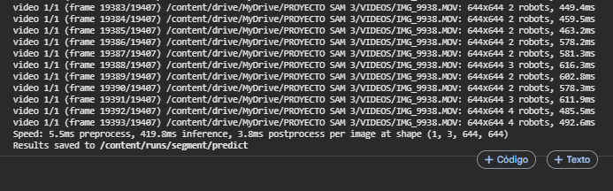{width="5.692708880139983in" height="1.7777898075240595in"}

En cada frame se guardaron las detecciones y sus segmentaciones correspondientes en archivo JSON. En otro notebook se cargaron nuevamente las detecciones en formato JSON, para poder crear el archivo CSV con cada aparición de #ID, y datos como área de caja, área de segmentación y el frame en que aparece. Este archivo aún requiere de limpieza y organización.

Cabe mencionar que la librería tqdm fue de vital importancia para ver el progreso en tiempo real, así como el manejo de errores con try y except, pues hubo varios frames cuyo archivo JSON no estaba y de haberlo manejado con condicionales habría hecho más complejo el código, por lo que el manejo de excepciones fue un gran acierto que ahorro mucho tiempo.

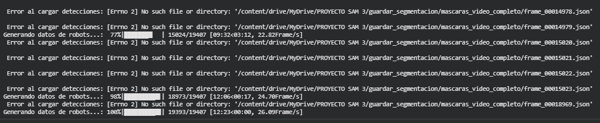{width="6.267716535433071in" height="1.2916666666666667in"}

En el archivo CSV se incluyeron los puntos canónicos, los cuales fueron calculados usando la matriz H obtenida en el notebook 0 de exploración de este proyecto.

b.  **Aislamiento y detección de pelota (Notebook 3)**

Debido a las anomalías en las segmentaciones de la pelota junto a los robots, se decidio crear un detector HSV exclusivamente para la pelota. Esto funcionó ya que la cámara estaba estatica y la iluminación era más o menos constante. Asimismo, ayudo el hecho de que era un color naranja muy brillante. Se hicieron varias pruebas hasta encontrar un rango que no excediera en pasarla por alto, ni se excediera en reconocer otros objetos (como luces o piel de los participantes). En esta etapa fue de mucha ayuda el sitio ***Pseudo Open CV.*** El cual tenia una seccion en la que podias subir una imagen y experimentar con los limites HSV y ver los resultados en tiempo real. Una vez encontrado el umbral adecuado, se ejecuto en el video completo y se guardaron los datos de las detecciones en formato CSV.

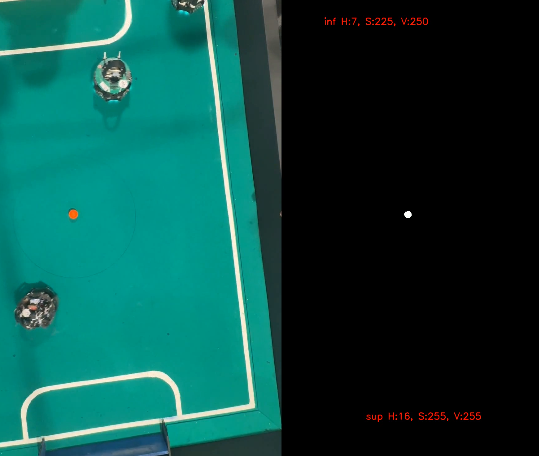{width="3.5677088801399823in" height="3.0178904199475065in"}

Aqui se aplicaron las tecnicas mostradas en el notebook 11. Tales como el uso de un kernel y modificaciones morfologicas para eliminar ruido y mejorar la deteccion de contornos.

c.  **Generación de datasets y recortes (Notebook 4)**

Una de las capacidades mas poderosas de SAM 3, es el poder generar datasets etiquetados automáticamente a partir de videos y fotografias, usando la funcion sv.crop_image de supervision y cv2.imwrite de Open CV. En esta etapa tuve ayuda de Claude para poder generar la funcion y poder entenderla. El codigo se configuro de tal forma que se pudiera elegir una muestra de frames no aleatoria cada 10,15 o 30 frames.

Lo que hace el código es nuevamente importar los datos guardados en el Notebook 1, sin tener que correr SAM 3 otra vez, y cargar solamente los datos de aquellos frames que se necesitan, porque por alguna razón que aun desconozco, el tiempo de cargar los JSON y convertirlos a sv.Detections es el mismo tiempo (aproximadamente) que tarda SAM 3 en hacer la inferencia por cada frame.

Aquí hice una filtración para guardar solamente aquellas detecciones que tuvieran un área de segmentación razonable, es decir, que no fueran ni muy pequeñas ni excesivamente grandes. El dataset generado consiste de más de 1000 imágenes de los robots 10A, 10B y 17B. Aun fue necesaria la verificación humana para eliminar imágenes que eran falsos positivos (una portería, ropa, la punta del bastón que se usa para acomodar la pelota), pero en este caso fueron menos de 10. La recolección se hizo cada 30 frames, es decir, cada segundo.

Esta funcionalidad es de las más útiles e impresionantes de SAM 3, pues puedes usar los datasets creados para entrenar modelos más pequeños que sí puedan ser usados en tiempo real. Ahorra demasiado trabajo de etiquetación por parte humana a cambio de tener poder de procesamiento con GPU. Esto se podía hacer también en la plataforma de Roboflow pero con ciertos límites ya que tienes una cantidad limitada de créditos al mes.

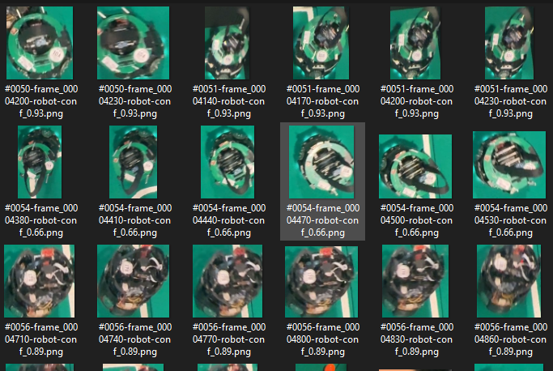{width="2.9264523184601923in" height="1.984375546806649in"}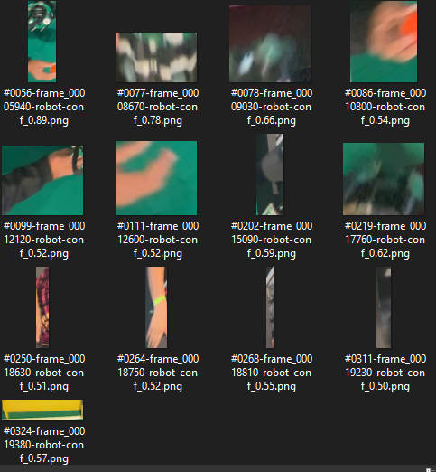{width="2.0781255468066493in" height="2.229099956255468in"}

Cabe mencionar que también use la librería de tqdm para ver el progreso en tiempo real, asi como manejo de excepciones para saltarse frames con error y no perder el progreso. Y le pedí a Claude que me generara una función para guardar los recortes con un formato de nombre específico que tuviera los datos mas importantes de la detección en el nombre mismo. No le pedí el código completo para guardar las fotos, sino que integre esa función en mi código.

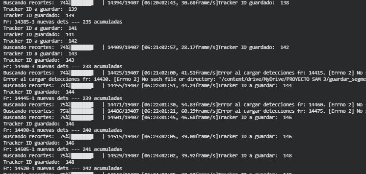{width="4.598620953630796in" height="2.1923654855643044in"}

d.  **Análisis de embeddings con SigLIP y ordenamiento de IDs de rastreo (Notebook 5).**

Es importante mencionar algo sobre esta sección: no se tenía planeado realizar este análisis, sino ignorar el notebook 14 del curso en Thinkific. Pero debido a que había más de 300 IDs de rastreo creo que valía la pena intentarlo. Para poder lograr esto copie línea por línea el notebook 14 hasta la parte donde se hacía el clustering con K Means, ignore las demás secciones debido a cuestiones de tiempo.

Dado que se mostraba que DINOv3 era robusto a cambios de color, se decidio usar otro que si fuera sensible a esos cambios, pues se buscaba al menos poder detectar el color del equipo.

No se tuvieron los resultados esperados dado que no pudo clasificar todos los IDs de forma correcta, solo aquellos en los que se veia claramente el robot. Por otra parte, se requiere de hacer otro notebook y otro flujo de procesamiento aplicado a cada ID, lo cual requería de más tiempo.

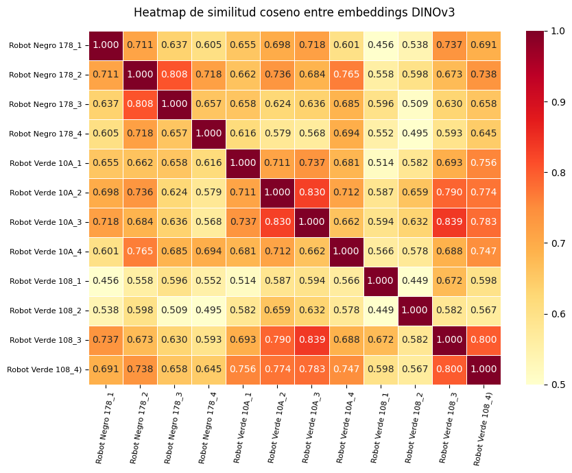{width="3.276042213473316in" height="2.7112073490813646in"}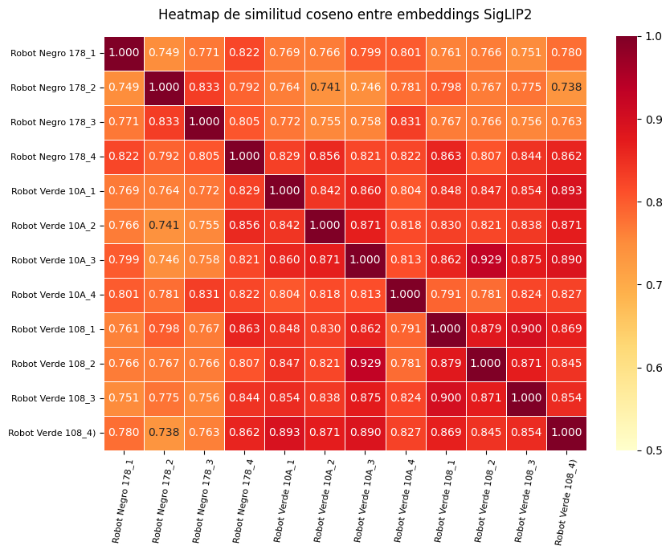{width="3.1093755468066493in" height="2.55875656167979in"}

En las gráficas de arriba se muestran mapas de calor generados en el tutorial del Notebook 14, con poco más de 10 screenshots recortados tomados de los robots. Gracias a estos screenshots surgió la idea de automatizar los recortes y probar que tal funcionaban con el análisis de embeddings. Se puede observar que SigLIP es más sensible al color pues entre los robots verdes los números son más altos que los de DINOv3. Esos números corresponden a la similitud coseno. La recomendación de SigLIP vino al consultar a Gemini sobre modelos más adecuados para una clasificación por robot.

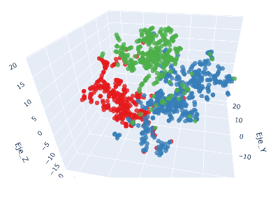{width="2.8802088801399823in" height="2.199770341207349in"}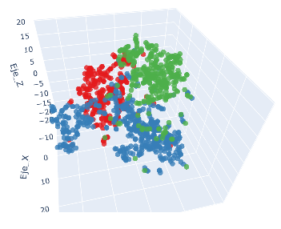{width="2.682292213473316in" height="2.179362423447069in"}

Se le indicó al modelo que se requieren 3 clusters. Las imágenes de arriba corresponden a la gráfica en 3D que se generó con plotly express y TSNE para obtener las proyecciones. Para poder crear esta gráfica interactiva se le consultó a Gemini las opciones. En este caso si copie y pegue el código tal como me lo dio pues solo quería hacer una exploración rápida.

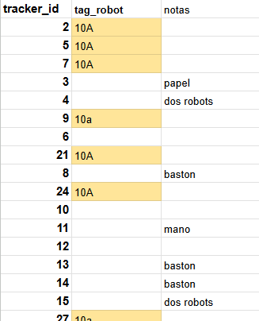{width="2.3649825021872264in" height="2.9218755468066493in"}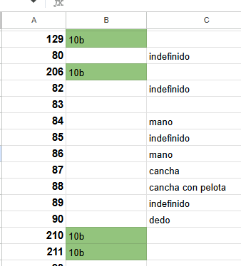{width="2.593555336832896in" height="2.869792213473316in"}

Al final me decante por la asignación manual utilizando una hoja de Google Spreadsheets, el proceso duró entre 2 y 3 horas (pues tuve que generar otro dataset de fotos con filtros más laxos para poder obtener todo el espectro de números de rastreo, que en total eran 328). Si bien no pude aplicar los embeddings para clasificar los robots, la generación automática del dataset de recortes de robot facilitó drásticamente el proceso manual, al evitar tener que seguir cada robot visualmente en el video.

Es importante mencionar también que el proceso manual requirió de mucho menos tiempo a comparación de leer, entender y replicar el notebook 14 y hacer algunas modificaciones. En contextos como este podría considerarse que aplica un refrán popular que dice "Salió más caro el caldo que las albóndigas". O posiblemente no, pues de paso pude recrear la funcionalidad de Roboflow

# 6.  ***Procesamiento de datos y limpieza (Notebook 6)***

Esta parte es un área del análisis de datos que también tiene una amplia variedad de técnicas y conocimientos, y que bajo ciertas condiciones podría considerarse otro proyecto aparte del de visión artificial. Por ejemplo, cuando se tuviera los datos de varios partidos y varios robots, el proceso de limpieza y ordenamiento del dataset requiere de metodologías específicas, más aún cuando se trata de variables que cambian con el tiempo.

El proceso de limpieza consistió en la eliminación de datos fuera de rango, datos negativos, o que no deberían de estar alli. Primero se comenzó con el dataset de la pelota. Eliminando valores de (x,y) que estuvieran fuera del rango de la cancha (182 cm de ancho y 243 cm de largo). Posteriormente se buscaron aquellos frames en los que había mas de una detección de pelota. Consisten de aproximadamente 20 segundos de video en total, después de pensar en formas adecuadas de tratarlos al final se decidió eliminarlos por completo y quedarnos con los frames donde habia una sola detección. Se calculó la velocidad de la pelota.

Para el de los robots, el proceso fue un poco diferente, pues primero se introdujeron las IDs correspondientes a los robots 10A, 10B y 17B, de forma hardcodeada. Se filtro el dataset y nos quedamos solo con las IDs válidas. Esto aun no garantizaba datos limpios, pues habían detecciones con medidas de ancho y largo de cajas de más de la mitad de las medidas de la cancha, por lo que se procedió a eliminar aquellas detecciones cuyo ancho superara una cuarta parte del ancho de la cancha, y lo mismo con las medida del largo.

Luego de estas modificaciones, se procedió a calcular la velocidad de cada robot, así como su distancia hacia la pelota. La columna de velocidad quedó pendiente de limpiar pues habían filas en las que se presentaba una velocidad de hasta 700 cm/s, lo cual no es posible para este tipo de robots. Asimismo, la velocidad se calculó con la posición de 15 frames hacia atrás, y no con la del frame anterior, pues las pequeñas variaciones hacen que la gráfica de velocidad se viera muy volátil.

Al final de esto se crearon 4 archivos csv de nombres

*robot_10a.csv*

*robot_10b.csv*

*robot_17b.csv*

*pelota_robots.csv*

En este último se intentó mezclar con la distancias y velocidades de los robots, pero al ejecutar la función describe() de pandas se podía observar que tenia menos filas que las de los robots originales, por lo que pudo haber un paso que no se ejecuto bien.

En esta etapa también se pide código a Gemini y Claude. Hubo varias ocasiones en las que se tuvo que recurrir a copiar y pegar el código directamente. A pesar de los inconvenientes, las columnas con datos no inconsistentes fueron muy útiles para visualizar y cuantificar lo observado durante el partido.

# 7.  ***Resultados y visualizaciones (Notebook 7 y 8)***

```{=html}
<!-- -->
```
a.  **Histogramas de distancia a pelota de cada robot e interpretación**

Durante el video se pueden observar algunas características acerca del rendimiento de cada robot. Se pueden describir de forma cualitativa. Cabe mencionar que los datos que se muestran aquí corresponden a los frames en los que tanto la pelota como el robot fueron detectados en el mismo frame. Y no representan todos los frames en los que estuvieron ambos elementos, debido a razones como falsos positivos, que SAM 3 no detecte al robot o que el filtro HSV no mostrara la pelota. Pero ***se asumira que es una muestra representativa de todo el total de frames en los que realmente estuvieron en pantalla***.

  --------------------------------------------------------------------------------------------------------------------------------------------------------------------------------------------------------------------------------------------------------
  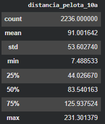{width="2.0625in" height="2.4444444444444446in"}   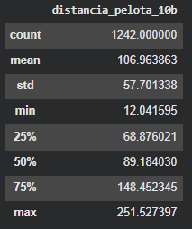{width="2.0625in" height="2.4583333333333335in"}   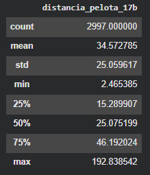{width="2.0625in" height="2.4027777777777777in"}
  ---------------------------------------------------------------------------------- ---------------------------------------------------------------------------------- ----------------------------------------------------------------------------------

  --------------------------------------------------------------------------------------------------------------------------------------------------------------------------------------------------------------------------------------------------------

Aquí se puede observar algo bastante contundente, y es que el 75% del tiempo, el robot 17B estuvo a menos de 46.19 cm de distancia del robot. Mientras que el robot 10A alcanzó una distancia similar en tan solo 25% de los frames registrados. El robot 10B estuvo el 75% de sus frames estuvo a una distancia mayor de 68.87 cm. En pocas palabras, ***el robot 17B presentó más iniciativa a acercarse a la pelota y pudo mantener esa distancia de forma más o menos estable***, pues su desviación estándar es menor que las de los robots del otro equipo. Asimismo, el promedio de la distancia a la pelota de 17B es de 34.57 cm un valor mucho menor comparado a los 91.00 cm y 106.96 cm de 10A y 10B, respectivamente.

En los siguientes graficos el eje X representa distancia en centimetros.

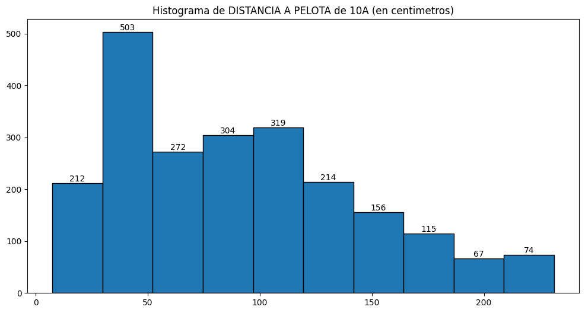{width="4.619792213473316in" height="2.4787259405074367in"}

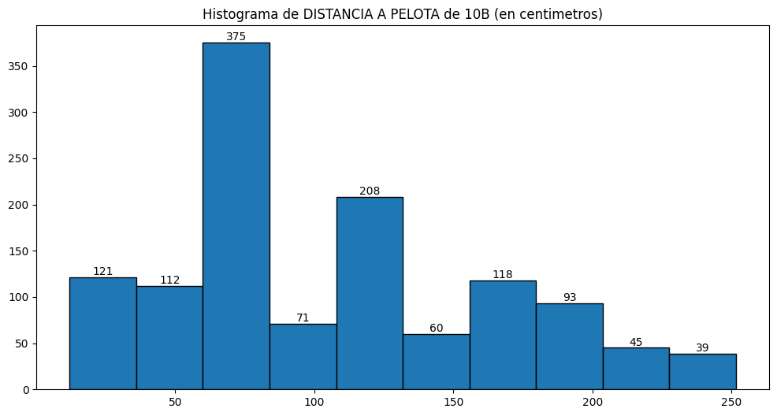{width="5.366141732283465in" height="2.8816283902012247in"}

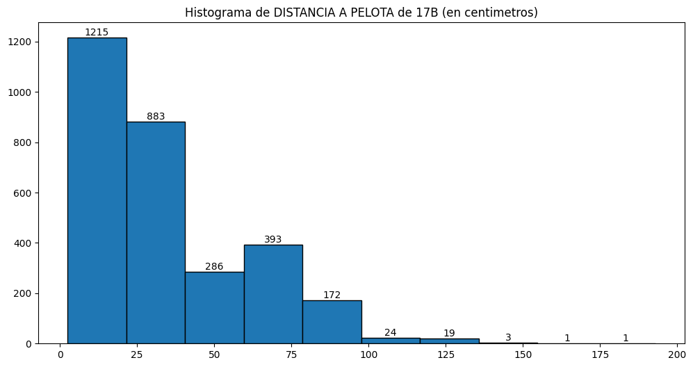{width="5.136975065616798in" height="2.7190037182852143in"}

b.  **Histogramas de velocidad e interpretación**

Se puede observar que el robot 17B no estuvo a mayor velocidad que el

  -------------------------------------------------------------------------------------------------------------------------------------------------------------------------------------------------------------------------------------------------------------------------------
  Robot 10A                                                                                      Robot 10B                                                                                     Robot 17B
  ---------------------------------------------------------------------------------------------- --------------------------------------------------------------------------------------------- ----------------------------------------------------------------------------------
  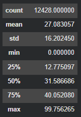{width="1.6770833333333333in" height="2.4270833333333335in"}   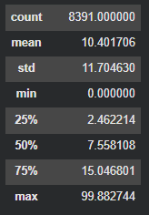{width="1.7083333333333333in" height="2.4583333333333335in"}   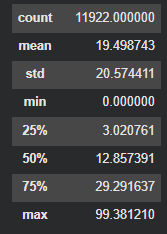{width="1.7395833333333333in" height="2.4375in"}

  -------------------------------------------------------------------------------------------------------------------------------------------------------------------------------------------------------------------------------------------------------------------------------

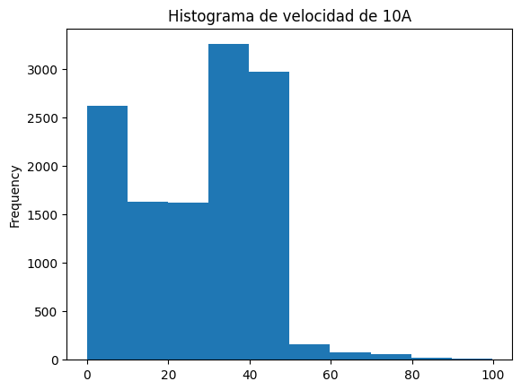{width="5.161137357830271in" height="3.8708530183727032in"}

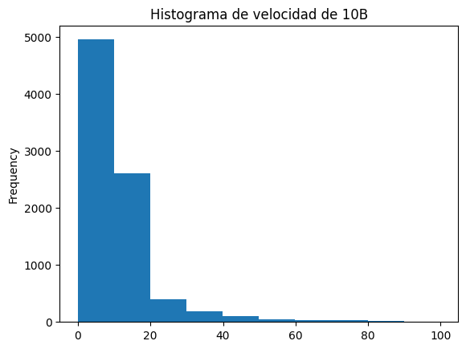{width="4.911458880139983in" height="3.6835936132983376in"}

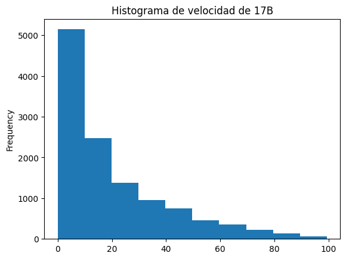{width="4.442708880139983in" height="3.3341633858267716in"}

c.  **Mapas de calor**

  --------------------------------------------------------------------------------------------
  Mapa de calor de posiciones de robot 10A
  --------------------------------------------------------------------------------------------
  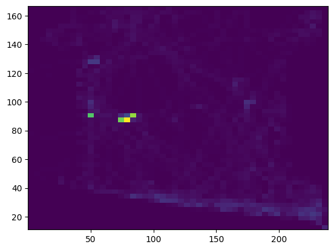{width="4.515625546806649in" height="3.3770702099737533in"}

  --------------------------------------------------------------------------------------------

  ---------------------------------------------------------------------------------------------
  Mapa de calor de posiciones de robot 10B
  ---------------------------------------------------------------------------------------------
  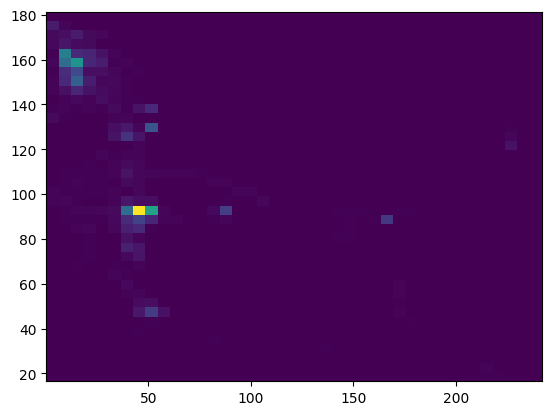{width="4.328125546806649in" height="3.2436286089238844in"}

  ---------------------------------------------------------------------------------------------

  --------------------------------------------------------------------------------------------
  Mapa de calor de las posiciones de Robot 17B
  --------------------------------------------------------------------------------------------
  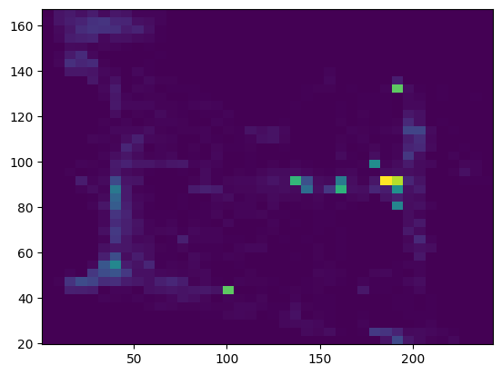{width="4.494792213473316in" height="3.361806649168854in"}

  --------------------------------------------------------------------------------------------

# 8.  ***Instrucciones de uso de notebooks.***

El objetivo de esta sección es explicar de forma general cómo implementar el flujo de trabajo por parte del lector en otros videos de la copa FutBotMX, y videos de competencias similares.

Lo más importante para poder correr los notebooks es modificar correctamente las rutas de acceso a los archivos. Están pensados solamente en el video IMG_9938.MOV, puede que para otros videos se requieran ligeras modificaciones. Funciona solo para videos que tengan una vista amplia y clara hacia la cancha, desde una perspectiva cenital. Ya que el punto del robot que se proyecto al plano canonico fue el centro de la caja delimitadora. Para videos con vista oblicua conviene proyectar el punto central inferior de la caja delimitadora.

Siempre se buscó programar de tal forma que las funciones y variables fueran autoexplicativas, en la medida de lo posible. A continuación se muestra un tabla con los datos de entrada y salida de cada notebook.

a.  **Resumen de funcionamiento, entradas y salidas de cada notebook.**

  --------------------------------------------------------------------------------------------------------------------------------------------------------------------------------------------------------------------------------------------------------------------------------------------------------------------------------------------------------------------------------------------------------------------------------------------------------------------------------------------------------------------------------------------------------------------------------------------------------------------------------------
  **Notebook**                                                **Funcion**                                                                                                                                                                                                                                        **Entrada**                                                                                                                                                     **Salida**
  ----------------------------------------------------------- -------------------------------------------------------------------------------------------------------------------------------------------------------------------------------------------------------------------------------------------------- --------------------------------------------------------------------------------------------------------------------------------------------------------------- -------------------------------------------------------------------------------------------------------------------------------------------------------
  *0. Exploracion - homografiasam3-videovertical.ipynb*       Ver como se comporta SAM 3 en un video de la Copa FutBot . Obtener matriz de transformación.                                                                                                                                                       Fragmento de 1 minuto de video IMG_9938.MOV                                                                                                                     Video de un minuto con robots segmentados, junto a las posiciones de cada robot en el mapa táctico.

  *1_SAM3_en_video_completo_y_guardar_segmentaciones.ipynb*   Guardar mascaras y cajas de detecciones de robots en formato JSON.                                                                                                                                                                                 Video completo IMG_9938.MOV                                                                                                                                     Una carpeta con miles de archivos JSON que guardan los datos de detecciones y segmentaciones.

  *2_Dataset_de_detecciones_de_robots_por_frame.ipynb*        Condensar los datos de los JSON en un solo archivo csv.                                                                                                                                                                                            Todos y cada unos de los miles de archivos JSON generados en el anterior Notebook                                                                               Un solo archivo CSV con cada deteccion y su frame correspondiente (muchos frames repetidos asi que se requiere de limpieza y organizacion posterior)

  *3_Dataset_pelota_video_completo.ipynb*                     Detectar la pelota y generar un archivo CSV igual que el anterior pero para la pelota.                                                                                                                                                             Video completo IMG_9938.MOV                                                                                                                                     Un archivo CSV con todas las detecciones de objetos dentro del rango HSV definido.

  *4_Generacion_de_dataset_de_fotos_de_robots.ipynb*          Generar un conjunto de datos de fotografias etiquetadas automaticamente que puede ser usado para entrenar modelos mas pequenos como YOLO o hacer clustering. Esta es una de las funciones mas utiles de SAM. Yo lo use para intentar clustering.   Una muestra de archivos JSON generados en el notebook 1. Cada uno puede tomarse cada 30 frames, o cada 15 frames, dependedieno de que tan grande se requiera.   Una carpeta con recortes de las detecciones en cada frame. Puede ahorrar horas de trabajo de etiquetado.

  *5_CLUSTERING_DATASET_COMPLETO_SigLIP.ipynb*                Poder asignar cada foto a su robot correspondiente (10a,10b,17b) o al menos distinguir equipos. Debe descargarse para poder visualizarse, pues en GitHub no se puede visualizar directamente.                                                      El dataset de las fotos generadas en el notebook anterior.                                                                                                      Centroides correspondientes a cada equipo o robot. Calculados en base a sus embeddings.

  *6_Procesamiento_de_Dataframes.ipynb*                       Generar archivos CSV aptos para analisis y visualizacion en Python, aplicando limpieza y eliminacion de datos sin sentido.                                                                                                                         Los dos archivos CSV que se generaron en el notebook 2 y 3.                                                                                                     4 archivos CSV con los datos de posicion, velocidad y distancia hacia la pelota. 1 correspondiente a cada robot, y uno exclusivamente para la pelota.

  *7. Procesamiento detallado del juego*                      Obtener visualizaciones y metricas estadisticas que cuantifiquen el comportamiento de cada robot durante el partido.                                                                                                                               Los 4 archivos CSV del notebook anterior.                                                                                                                       Histogramas de velocidad, distancia a la pelota de cada robot. Asi como estadisticas generales.

                                                                                                                                                                                                                                                                                                                                                                                                                                                                                 
  --------------------------------------------------------------------------------------------------------------------------------------------------------------------------------------------------------------------------------------------------------------------------------------------------------------------------------------------------------------------------------------------------------------------------------------------------------------------------------------------------------------------------------------------------------------------------------------------------------------------------------------

b.  **Requisitos de hardware y software.**

Un entorno de desarrollo en la nube como Google Colab y Kaggle, con entornos en los que la memoria virtual de la GPU sea de al menos 16GB, son suficientes para poder ejecutar los notebooks. Para ejecutar el modelo de SAM3 se usaron memorias T4 de Nvidia (las proporcionadas por Colab y Kaggle).

# 9.  **Conclusiones**

Se logro desarrollar un conjunto de notebooks que emulan el objetivo inicial. SAM 3 fue el punto central para el desarrollo de todo el proyecto, pues no fue necesario entrenar ningun modelo y tiene un gran potencial para muchas aplicaciones del mundo real, una de las mas poderosas es la etiquetacion casi automatica de imagenes y generacion de conjuntos de datos para diversos modelos destinados a entornos que requieren procesamiento en tiempo real.

Como se menciono en un inicio, la parte que mas trabajo tomo fue la de entender todo el ecosistema de ultralytics y supervision, siendo este el primer contacto con un proyecto que directamente aplica un modelo ya entrenado y lo despliega. Muchos notebooks usaron datos que fueron generados gracias a la segmentacion mediante prompts de texto.

Es muy importante mencionar que todo este análisis lo logré gracias a la información y guía que estaba en los notebooks de Thinkific, pues inicialmente no tenía pensado hacer una gran cantidad de código y funciones. Si bien ya contaba con experiencia en programación y Python, desconocía todo el conocimiento y habilidades necesarias que se requieren para desplegar y aplicar un modelo de visión artificial.

## 10. **Referencias y creditos.**

OpenCV (cv2)

OpenCV Team. (2026). OpenCV: Open Source Computer Vision Library (Versión 4.x) \[Software\]. https://opencv.org/

Supervision

Roboflow. (2026). Supervision: Reusable computer vision tools (Versión más reciente) \[Software\]. GitHub. https://github.com/roboflow/supervision

Ultralytics

Jocher, G., Chaurasia, A., & Qiu, J. (2026). Ultralytics YOLO (Versión más reciente) \[Software\]. GitHub. https://github.com/ultralytics/ultralytics

NumPy

Harris, C. R., Millman, K. J., van der Walt, S. J., Gommers, R., Virtanen, P., Cournapeau, D., Wieser, E., Taylor, J., Berg, S., Smith, N. J., Kern, R., Picus, M., Hoyer, S., van Kerkwijk, M. H., Brett, M., Haldane, A., del Río, J. F., Wiebe, M., Peterson, P., \... Oliphant, T. E. (2020). Array programming with NumPy. Nature, 585(7825), 357--362. https://doi.org/10.1038/s41586-020-2649-2

Matplotlib

Hunter, J. D. (2007). Matplotlib: A 2D graphics environment. Computing in Science & Engineering, 9(3), 90--95. https://doi.org/10.1109/MCSE.2007.55

Pandas

The pandas development team. (2026). pandas-dev/pandas: Pandas (Versión más reciente) \[Software\]. Zenodo. https://doi.org/10.5281/zenodo.3509134

pycocotools

Lin, T.-Y., Maire, M., Belongie, S., Hays, J., Perona, P., Ramanan, D., Dollár, P., & Zitnick, C. L. (2014). Microsoft COCO: Common objects in context. En Computer Vision -- ECCV 2014 (pp. 740--755). Springer. https://doi.org/10.1007/978-3-319-10602-1_48

json

Python Software Foundation. (2026). json --- JSON encoder and decoder. Documentación de Python. https://docs.python.org/3/library/json.html

os

Python Software Foundation. (2026). os --- Miscellaneous operating system interfaces. Documentación de Python. https://docs.python.org/3/library/os.html

tqdm

da Costa-Luis, C., Larroque, S. K., Altendorf, K., Mary, H., richardsheridan, Korobov, M., Yorav-Raphael, N., Ivanov, I., Bargull, M., Rodrigues, N., Chen, G., Mark, Lee, A., Newey, C., Coales, J., Zugnoni, M., Pagel, M. D., Materzok, J., Lanigan-Atkins, J., \... Marić, D. (2026). tqdm: A fast, extensible progress bar for Python (Versión más reciente) \[Software\]. https://doi.org/10.5281/zenodo.595120
